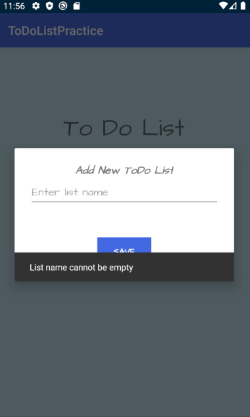
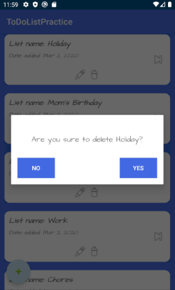
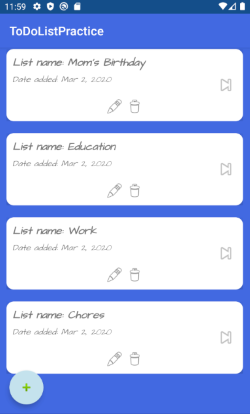
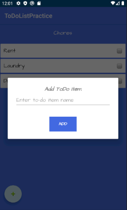

# ToDO List: Recycler View and Database Operations
In this app, I created a simple to-do list application where user creates
desired to-do lists with desired items and modify them when needed.

In my project, in order to implement database operations I used SQLiteOpenHelper.
I also implemented custom RecyclerView adapters to bind the data to views.

## Screenshots

If user does not have to-do lists in the database, below screen is the
first screen user encounters.

 
As soon as the user adds a to-do list using the floating action button,
user will be redirected to the lists screen. Lists screen is a screen
where user's all to-do lists are displayed. When user runs the app, if
user has existing to-do lists introduction screen will be bypassed and Lists
screen will be shown immediately.

 &nbsp;&nbsp;&nbsp; 

 
On lists screen user can add more to-do lists using the floating action
button.

 
User can update an existing to-do list by clicking the corresponding edit
icon.

 
User can also delete an existing to-do list by clicking the corresponding
delete icon. If all existing lists are deleted, user gets redirected to
the introduction screen.

 &nbsp;&nbsp;&nbsp; 

 
Once user clicks forward icon on a certain to-do list, he/she will be redirected
to the items screen of that particular to-do list. On this screen, user
can add new to-do items.

 
On this screen, user can also check the ones he/she already completed as well as being
able to uncheck them if desired.

